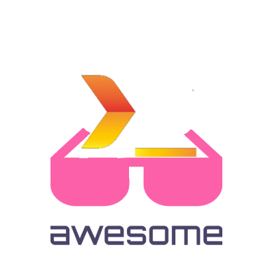

<!--lint disable awesome-git-repo-age-->

   
    
   

# Awesome Textualize Projects  [<!--lint ignore no-dead-urls-->](https://github.com/oleksis/awesome-textualize-projects/actions/workflows/lint.yml)

> A curated list of awesome projects related to [Textualize].

Textualize is responsible for creating frameworks / projects like:

- [Textual](https://github.com/Textualize/textual):
    a TUI (Text User Interface) framework for Python inspired by modern web development.
- [Rich](https://github.com/Textualize/rich):
    a Python library for rich text and beautiful formatting in the terminal.
- [Rich CLI](https://github.com/Textualize/rich-cli):
    a command line toolbox for fancy output in the terminal

## Contents

- [Official Resources](#official-resources)
  - [Textual](#textual)
  - [Rich](#rich)
  - [Rich CLI](#rich-cli)
- [Community](#community)
  - [Third Party Applications](#third-party-applications)
- [Tutorials](#tutorials)

## Official Resources
<!--lint ignore awesome-list-item-->
- [Official Site][textualize]
- [Official Textualize organization](https://github.com/Textualize)
- [Textualize Blog Announcement](https://www.textualize.io/blog)

### Textual

- [Textual Docs](https://textual.textualize.io/) - Build amazing TUIs (Text User Interfaces) with this innovative Python framework.
- [Gallery](https://www.textualize.io/textual/gallery)

### Rich

- [Rich Docs](https://rich.readthedocs.io/en/latest/) - Beautiful output in the terminal and Jupyter notebook with this powerful Python library. Tables, panels, progress bars, trees, syntax highlighting, pretty printing, and much more.
- [Gallery](https://www.textualize.io/rich/gallery)

### Rich CLI

- [Rich CLI Repository](https://github.com/Textualize/rich-cli.git) - Rich from the command prompt. Syntax highlight many file-types, with special support for markdown, json, and CSV tables.

## Community

- [Textualize Community](https://community.textualize.io/) - This community is for those wishing interesting in build user interfaces within the terminal using Rich and Textual.

### Third Party Applications

- [Markdown Browser](https://github.com/willmcgugan/textual-markdown) - Markdown in the terminal.
- [Kupo](https://github.com/darrenburns/kupo) - A terminal file browser, kupo!
- [Dunk](https://github.com/darrenburns/dunk) - Prettier git diffs in the terminal 🎨.
- [Shira](https://github.com/darrenburns/shira) - The python inspector 🔍.
- [Autocomplete](https://github.com/darrenburns/textual-autocomplete) - Easily add autocomplete dropdowns to your Textual apps.
- [Rich Pixels](https://github.com/darrenburns/rich-pixels) - A Rich-compatible library for writing pixel images and ASCII art to the terminal.
- [Astview](https://github.com/davep/textual-astview) - A Textual-based Python AST viewing widget library and application.
- [FivePyFive](https://github.com/davep/fivepyfive) - An annoying puzzle for the terminal; built with Textual.
- [HumBLE Explorer](https://github.com/koenvervloesem/humble-explorer) - A cross-platform, command-line and human-friendly Bluetooth Low Energy Scanner built with Textual.
- [Select](https://github.com/mitosch/textual-select) - A simple drop-down (select) for Textual with an optional search functionality.

## Tutorials

- Welcome to the [Textual Tutorial](https://textual.textualize.io/tutorial/)!

> Please don't hesitate to make a PR if you have more resources to share. Check out [contributing.md](contributing.md) for more information.

[textualize]: https://www.textualize.io/
